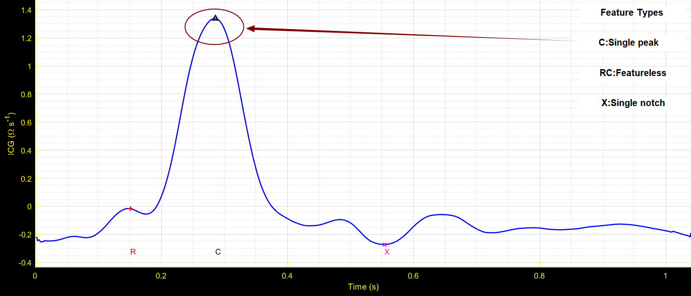
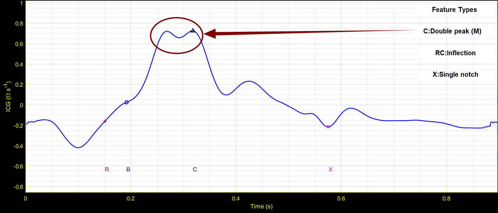
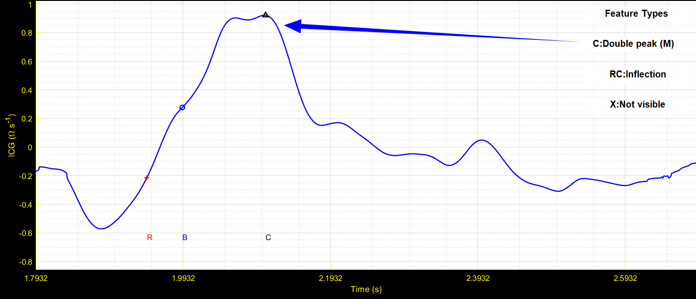
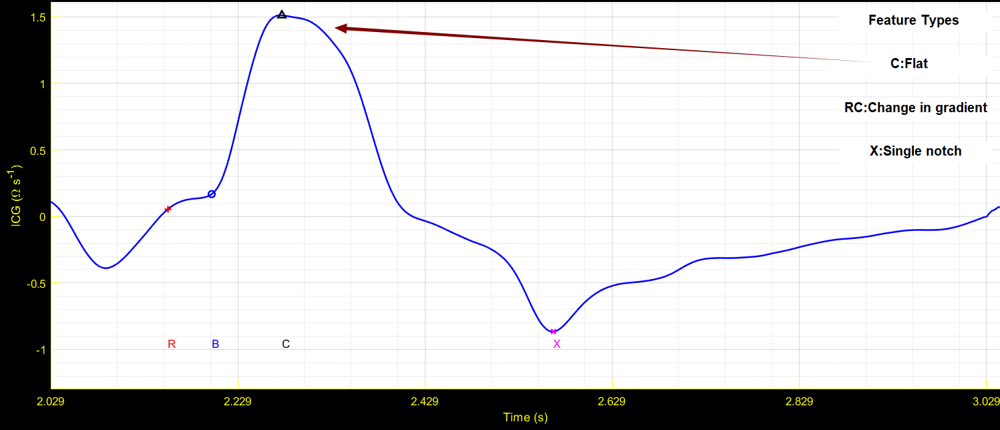
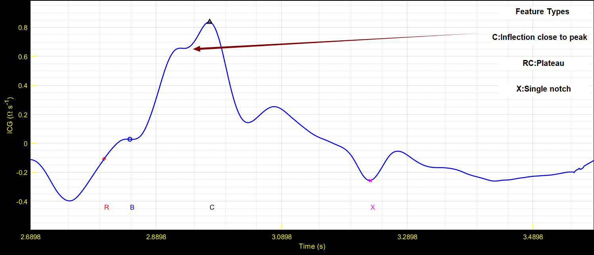
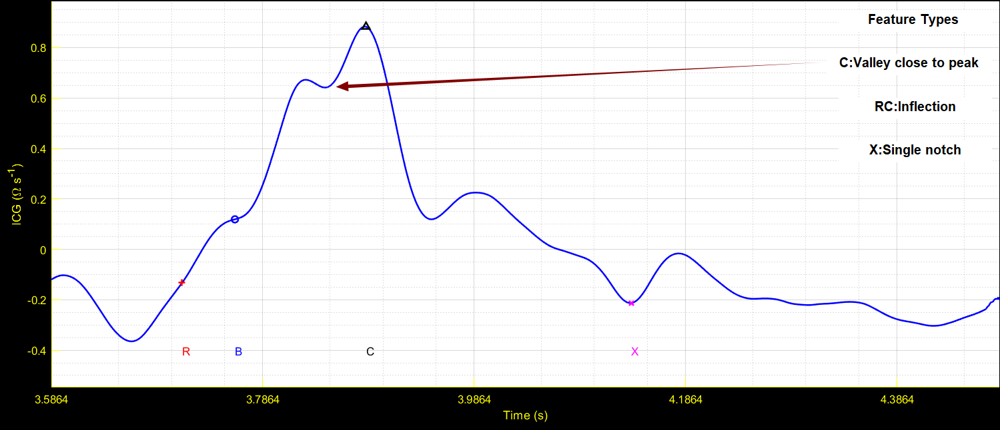
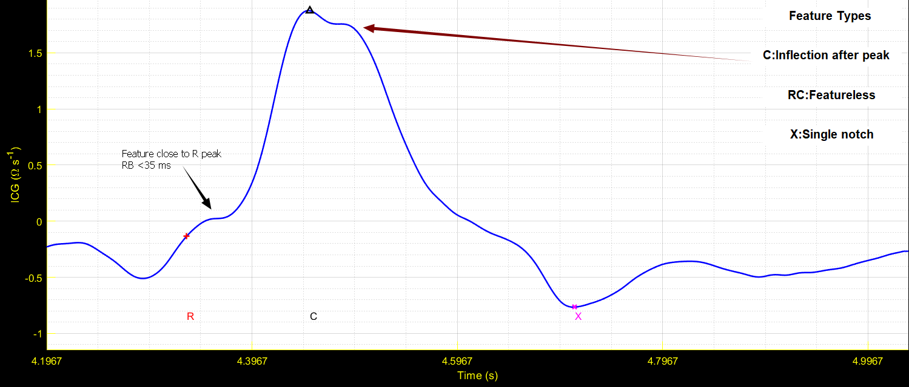
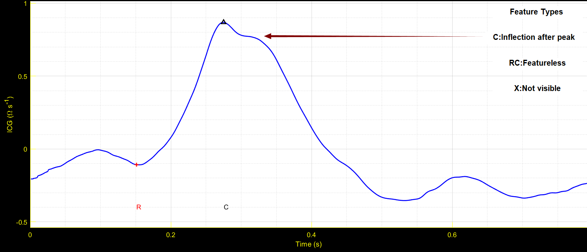
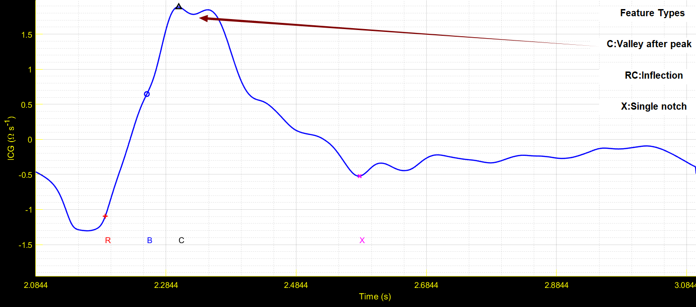

# ICMAA_C_Shape
A library of images of C point shapes in ICG.

## Single peak

## Double peak (M)

## Flat

## Inflection close to peak

## Valley close to peak

## Inflection after peak

## Valley after peak

