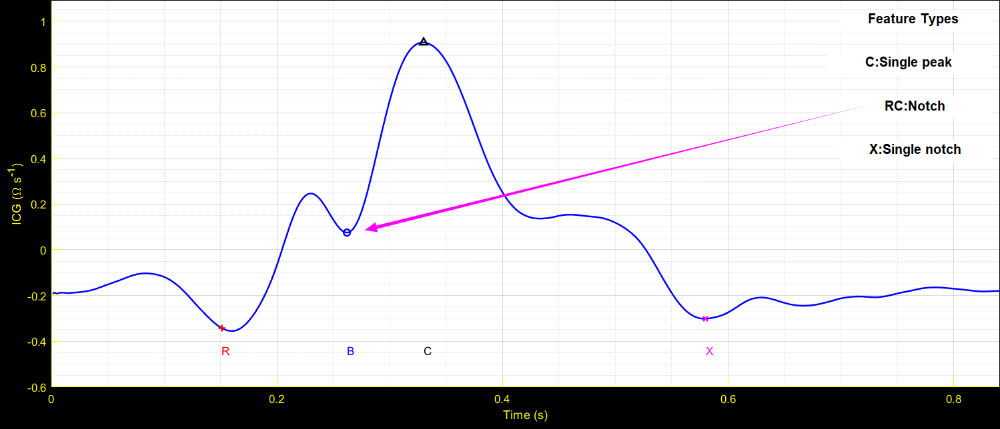
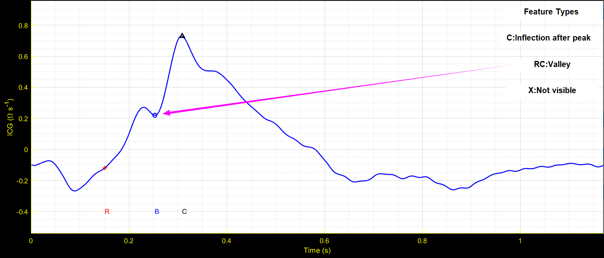
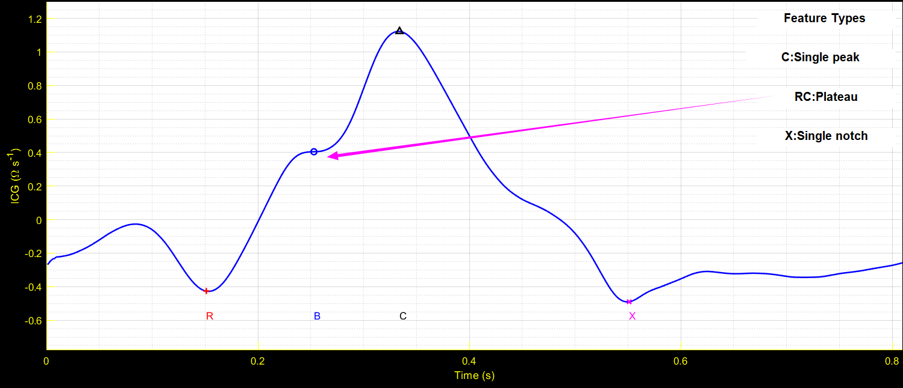
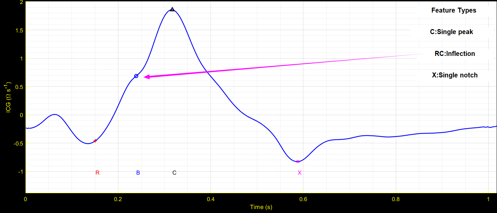
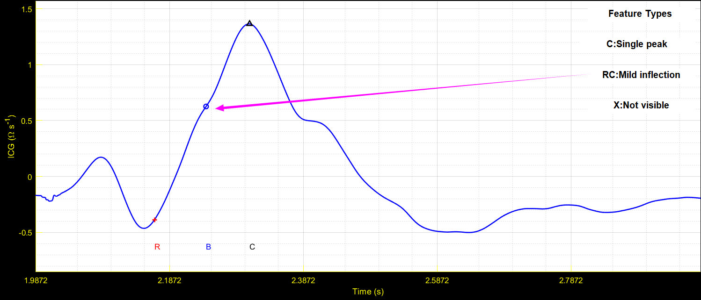
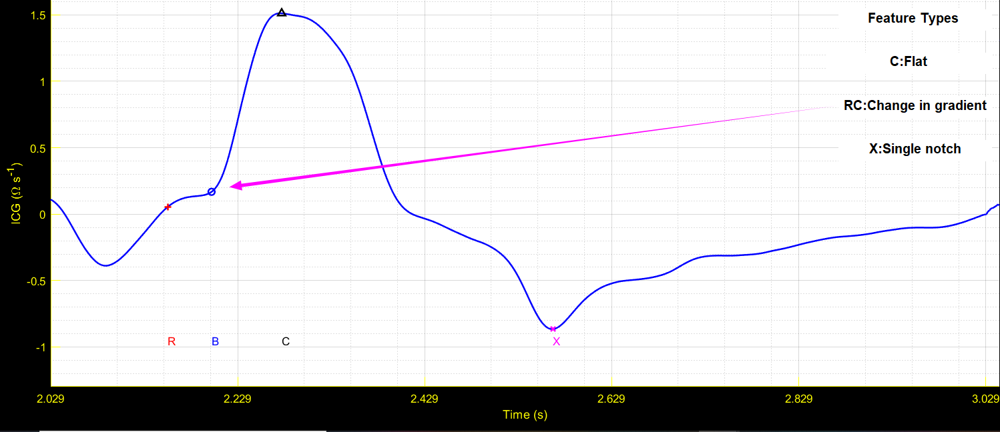
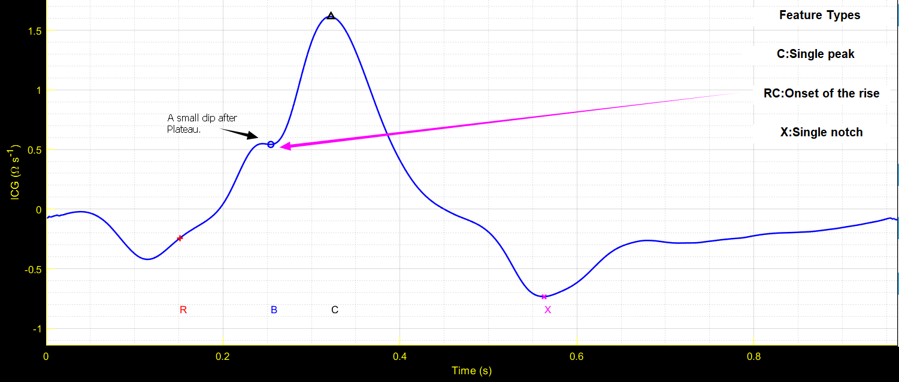
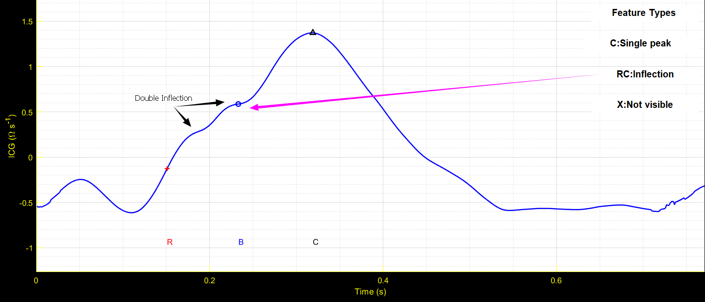

# ICMAA_RC_Feature
A library of images of feature between R peak and C point of synchronized ECG and ICG signal respectively.

## Notch

## Valley

## Plateau

## Inflection

## Mild Inflection

## Change in gradient

## Onset of the rise

## Featureless

## Double Feature

