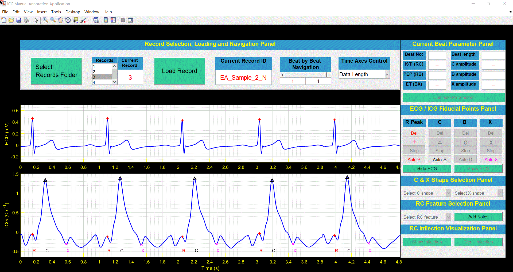
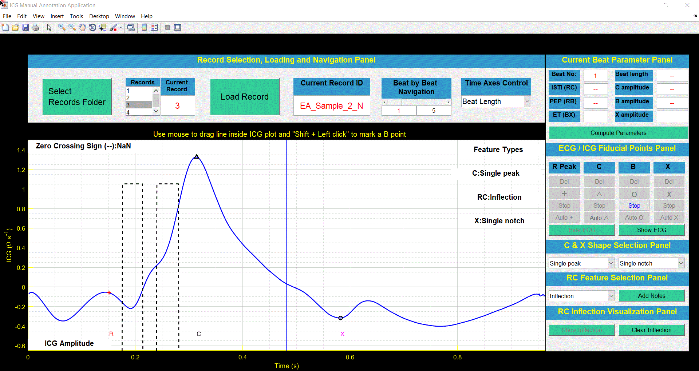
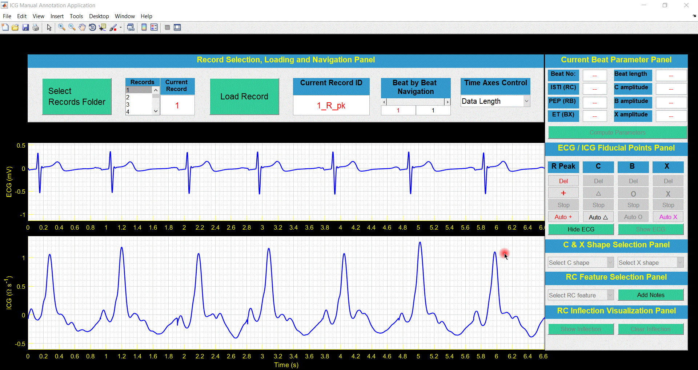
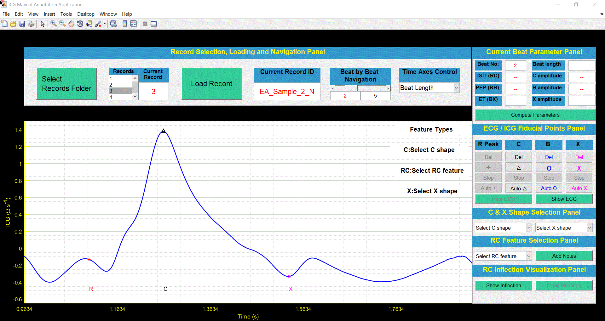
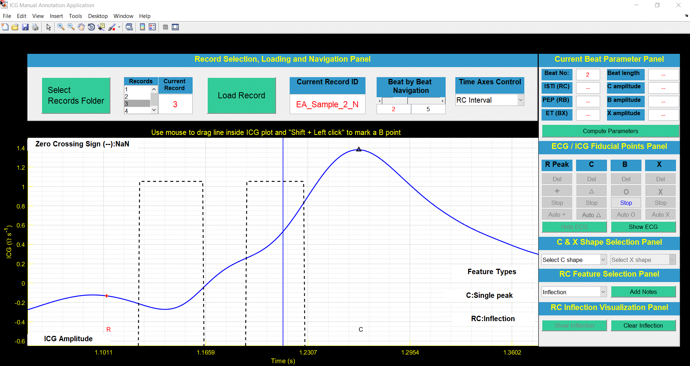
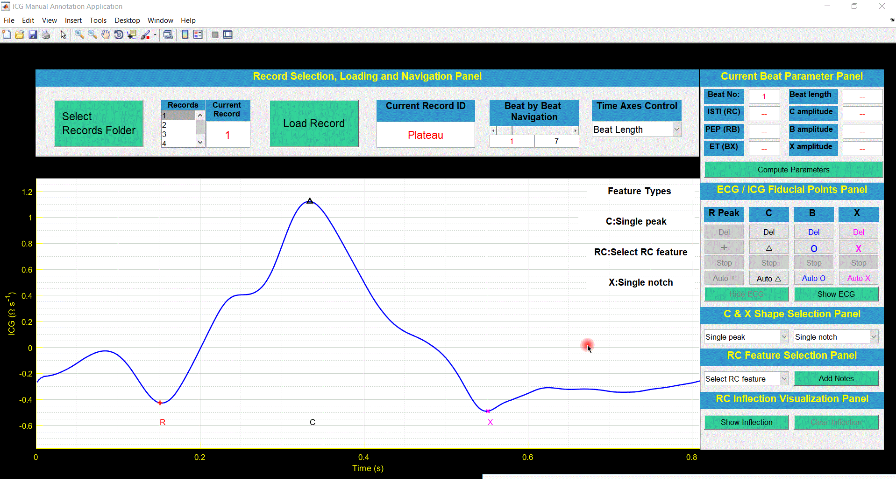
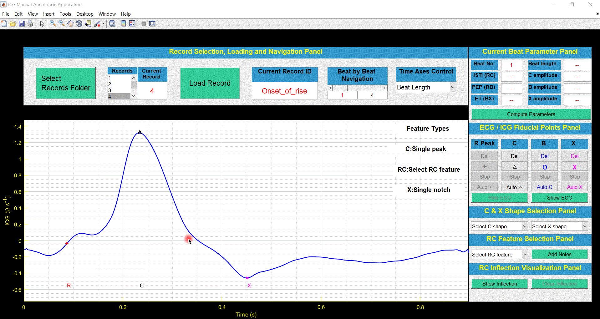

# Impedance Cardiogram Manual Annotation Application (ICMAA)
An application for automatic and manual annotation of fiducial points on ensemble-averaged (EA) ECG and ICG beats.

## Demonstration - ICMAA
1. [Annotation Process](#1)
    - [Saving EA ECG and ICG records](#1a)
    - [Launch ICMAA](#1b) 
    - [Folder Selection and Loading Record](#1c) 
    - [Automatic Annotation - Rpeak, C point and X point](#1d)
    - [Hide ECG and Beat Length View](#1e)
    - [Select C shape](#1f)
    - [Select X shape](#1g)
    - [Select RC Feature](#1h)
    - [Manual Annotation - B point on Feature: Inflection/ Mild Inflection](#1i)
    - [Compute Hemodynamic Parameters](#1j)
    - [Beat by Beat Navigation](#1k)
    - [Annotation Files](#1l)
2. [ICMAA Panels: Functions](#2)
    - [ECG/ICG Fiducial Point Panel](#21)
        - [Manual Deletion/Annotation R peak](#21a)
        - [Manual Deletion/Annotation C point](#21b)
        - [Manual Deletion/ Annotation B point](#21c)
        - [Manual Deletion/Annotation X point](#21d)
    - [RC Inflection Visualization Panel](#22)
    - [Time Axes Control](#23)
      - [Using RC Interval in Time Axes Control](#23a)
      - [Manual Annotation of B point in RC Interval mode](#23b)
3. [B point Annotation Examples](#3)
    - [Manual Annotation - B point on Feature: Valley/Notch](#3a)
    - [Manual Annotation - B point on Feature: Plateau](#3b)
    - [Manual Annotation - B point on Feature: Onset of the Rise](#3c)
    - [Manual Annotation - B point on Feature: Change in Gradient](#3d)
    - [Automatic Annotation - B point on Featureless](#3e)

### 1. Annotation Process

#### Saving EA ECG and ICG records

Download and save EA ECG and ICG signal in a folder on local machine from [here](https://github.com/cliffordlab/ICG_OSToolbox/tree/master/ICG_ECG_Demo_Data/Ensemble_Averaged_ECG_ICG). 
For demonstration purpose, we have saved EA ECG_ICG records in the folder 'Ensemble_Averaged_ECG_ICG' as shown in gif below.

#### Launch ICMAA
Open ICMAA.m in MATLAB and click the run button to launch.

#### Folder Selection and Loading Record
Use button`Select Records Folder` to select folder **Ensemble_Averaged_ECG_ICG** which contains four EA ECG_ICG records. While selecting folder, the pop up window will not show files because we are selecting the folder and not the files. The four records will be visible in `Records` listbox. Select record from the list box and use `Load Record` to load EA ECG and ICG record in ICMAA. The top window will show EA ECG signal and bottom window will show EA ICG signal.

#### Automatic Annotation - Rpeak, C point and X point
With `Time Axes Control` set to **Data Length**, use **ECG/ ICG Fiducial Points Panel** to automatically annotate R peaks, C points, and X points. Click button `Auto` under these fiducial point for automatic annotation.

#### Hide ECG and Beat Length View
Use button `Hide ECG` to hide the ECG plot, and set popup menu `Time Axes Control` to **Beat Length**. This will show single EA ICG beat in plot area.

#### Select C shape
In **C & X Shape Selection Panel**, use popup menu `Select C shape` to select the shape of C point. In this case, C shape is single peak. Images of different C shapes can be found [here](https://github.com/cliffordlab/ICG_OSToolbox/tree/master/ICG_Annotation/ICMAA_C_shape).

#### Select X shape
In **C & X Shape Selection Panel**, use popup menu `Select X shape` to select the shape of X point. In this case, X shape is single notch. Images of different X shapes can be found [here](https://github.com/cliffordlab/ICG_OSToolbox/tree/master/ICG_Annotation/ICMAA_X_shape).

#### Select RC Feature
In **RC Feature Selection Panel**, use popup menu `Select RC Feature` to select the type of feature between R peak and C point on EA ICG beat. In this case, the feature is **inflection**. With selection of inflection in popup menu, button`Show Inflection` will also be enabled and inflection visualization feature of ICMAA will be activated. Dotted lines alongwith **Zero Crossing Sign** will appear on the plot. Images of different features between Rpeak and C point can be found [here](https://github.com/cliffordlab/ICG_OSToolbox/tree/master/ICG_Annotation/ICMAA_RC_Feature). 

#### Manual Annotation - B point on Feature: Inflection/Mild Inflection
After selecting RC feature as inflection/mild inflection, use mouse to select the solid blue line. The solid blue line will also convert into broken blue line. Use mouse to drag the line inside ICG plot. **Zero Crossing Sign** will also change from NaN to -1 or +1. Align broken blue line with dotted black line, once **Zero Crossing Sign** changes from -1 to +1. Use **Shift + Left Click** to mark B point.

#### Compute Hemodynamic Parameters
In **Current Beat Parameter Panel**, use button `Compute Parameters` to display hemodynamic parameters such as Pre-ejection period (RB interval), Inter-systolic time interval (ISTI - RC interval), ejection time (ET - BX interval), ejection velocity index (C point amplitude), B point amplitude and X point amplitude for current beat. 

#### Beat by Beat Navigation
In **Record Selection and Loading Panel**, use slider bar `Beat by Beat Navigation` to navigate between different beats of a record to perform annotation.

#### Annotation Files
During the process of annotation, all the annotation files are saved in .txt format in a subfolder **Ensemble_Averaged_ECG_ICG_manual_annotation** inside the  **Ensemble_Averaged_ECG_ICG** which contains four EA ECG_ICG records. These text files can be accessed anytime for further analysis. 

### ICMAA Panels: Functions
Most of the panels of ICMAA have been explained in [process of annotation](#1). Functionality of remaining panels is described below:

#### ECG/ICG Fiducial Point Panel

##### Manual Deletion/Annotation R peak
In case, Physionet toolbox incorrectly detects R peaks, then in **ECG/ICG Fiducial Points Panel**, under **R Peak**, use button `Del` to delete R peak and use **+** to manually annotate R peaks. Use mouse to select the solid red line. The solid red line will convert into broken red line. Use broken red line to annotate R peak at maximum of ECG beat by looking at **ECG amp** in lower left corner of ECG plot. 

##### Manual Deletion/Annotation C point
In **ECG/ICG Fiducial Points Panel**, under **C** point, use button `Del` to delete C point and use small triangle to manually annotate C point. Use mouse to select the solid black line. The solid black line will convert into broken black line. Use broken black line to annotate C point at maximum of ICG beat by looking at **ICG amp** in lower left corner of ICG plot. 

##### Manual Deletion/Annotation B point
In **ECG/ICG Fiducial Points Panel**, under **B** point, use button `Del` to delete B point and use **o** to manually annotate B point. Use mouse to select the solid blue line. The solid blue line will convert into broken blue line. Use broken blue line to annotate B point at ICG beat by looking at **ICG amp** in lower left corner of ICG plot. 

##### Manual Deletion/Annotation X point
In **ECG/ICG Fiducial Points Panel**, under **X** point, use button `Del` to delete X point and use **X** to manually annotate X point. Use mouse to select the solid magenta line. The solid magenta line will convert into broken magenta line. Use broken magenta line to annotate X point at minimum of ICG beat by looking at **ICG amp** in lower left corner of ICG plot. 

#### RC Inflection Visualization Panel
In **RC Inflection Visualization Panel**, use button `Show Inflection` to visualize **Zero Crossing Sign (--)** along with dotted black lines. Use button `Clear Inflection` to clear the **Zero Crossing Sign (--)** and dotted black lines. Use mouse to select the solid blue line. The solid blue line will also convert into broken blue line. Use mouse to drag the line inside ICG plot. **Zero Crossing Sign** will also change from NaN to -1 or +1. Align broken blue line with dotted black line, once **Zero Crossing Sign** changes from -1 to +1. Use **Shift + Left Click** to mark B point.

#### Time Axes Control

##### Using RC Interval in Time Axes Control
In **Record Selection and Loading Panel**, use  pop up menu `Time Axes Control` to select **RC Interval**. The ICG plot will be zoomed in to display RC interval. In **RC Feature Selection Panel**, use popup menu `Select RC Feature` to select the type of feature between R peak and C point on EA ICG beat. In this case, the feature is **inflection**. With selection of inflection in popup menu, button`Show Inflection` will also be enabled and inflection visualization feature of ICMAA will be activated. Dotted lines alongwith **Zero Crossing Sign** will appear on the plot. Images of different features between Rpeak and C point can be found here. 

##### Manual Annotation of B point in RC Interval mode
Use mouse to select the solid blue line. The solid blue line will also convert into broken blue line. Use mouse to drag the line inside ICG plot. **Zero Crossing Sign** will also change from NaN to -1 or +1. Align broken blue line with dotted black line, once **Zero Crossing Sign** changes from -1 to +1. Use **Shift + Left Click** to mark B point.

### B point Annotation Examples

#### Manual Annotation - B point on Feature: Notch/Valley
After selecting RC feature as **Notch** from pop-up menu `Select RC feature`, use mouse to select the solid blue line. The solid blue line will convert into broken blue line. Use mouse to drag the line inside ICG plot. Use broken blue line to annotate B point at minimum of ICG beat after R peak by looking at **ICG amp** in lower left corner of ICG plot. 

#### Manual Annotation - B point on Feature: Plateau

After selecting RC feature as **Plateau** from pop-up menu `Select RC feature`, use mouse to select the solid blue line. The solid blue line will convert into broken blue line. Use mouse to drag the line inside ICG plot. **Zero Crossing Sign** will also change from NaN to -1 or +1. Align broken blue line with dotted black line, once **Zero Crossing Sign** changes from -1 to +1. Use **Shift + Left Click** to mark B point.

#### Manual Annotation - B point on Feature: Onset of the Rise
 After selecting RC feature as **Onset of the Rise** from pop-up menu `Select RC feature`, use mouse to select the solid blue line. The solid blue line will convert into broken blue line. Use mouse to drag the line inside ICG plot. Use broken blue line to annotate B point at the onset of the rise. In this example, the feature **Plateau** is close to R peak and makes RB < 35 ms, which is physiologically not possible.

 #### Manual Annotation - B point on Feature: Change in Gradient
 After selecting RC feature as **Change in Gradient** from pop-up menu `Select RC feature`, use mouse to select the solid blue line. The solid blue line will convert into broken blue line. Use mouse to drag the line inside ICG plot. Use broken blue line to annotate B point at the Change in Gradient. In this example, the feature **Plateau** is close to R peak and makes RB < 35 ms, which is physiologically not possible.
 
 
 
 
 #### Automatic Annotation - B point on Featureless
 In case, there is no feature between R peak and C point in EA ICG beat. Select **Featureless** from pop-up menu `Select RC feature`. ICMAA will automatically mark B point on EA ICG beat. In this example, the feature **Valley** is close to R peak and makes RB < 35 ms, which is physiologically not possible.
 
 

 
 
