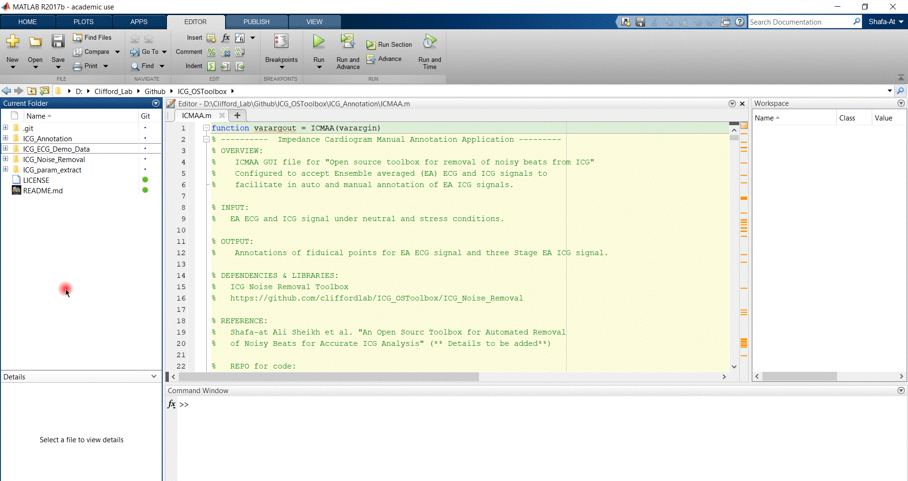
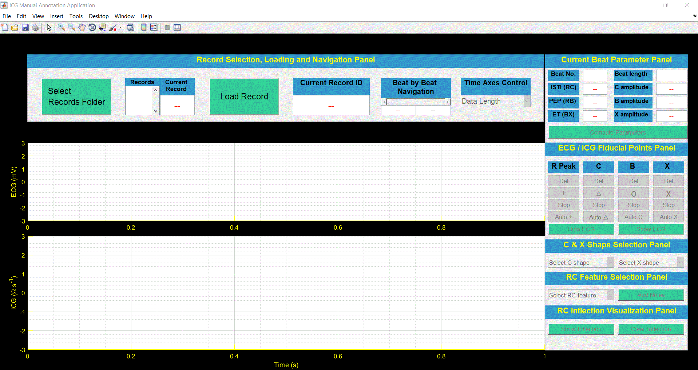

# Impedance Cardiogram Manual Annotation Application (ICMAA)
An application for automatic and manual annotation of fiducial points on ensemble-averaged (EA) ECG and ICG beats.

## Demonstration - ICMAA

### 1. Saving EA ECG and ICG records

Download and save EA ECG and ICG signal in a folder on local machine from [here](https://github.com/cliffordlab/ICG_OSToolbox/tree/master/ICG_ECG_Demo_Data/Ensemble_Averaged_ECG_ICG). 
For demonstration purpose, we have saved EA ECG_ICG records in the folder 'Ensemble_Averaged_ECG_ICG' as shown in gif below.

### 2. Launch ICMAA
Open ICMAA.m in MATLAB and click the run button to launch.

### 3. Folder selection and loading record
3. Use button`Select Records Folder` to select folder "Ensemble_Averaged_ECG_ICG" which contains four EA ECG_ICG records. While selecting folder, the pop up window will not show files because we are selecting the folder and not the files. The four records will be visible in `Records` listbox. Select record from the list box and use 'Load Record' to load EA ECG and ICG record in ICMAA. The top window will show EA ECG signal and bottom window will show EA ICG signal.

